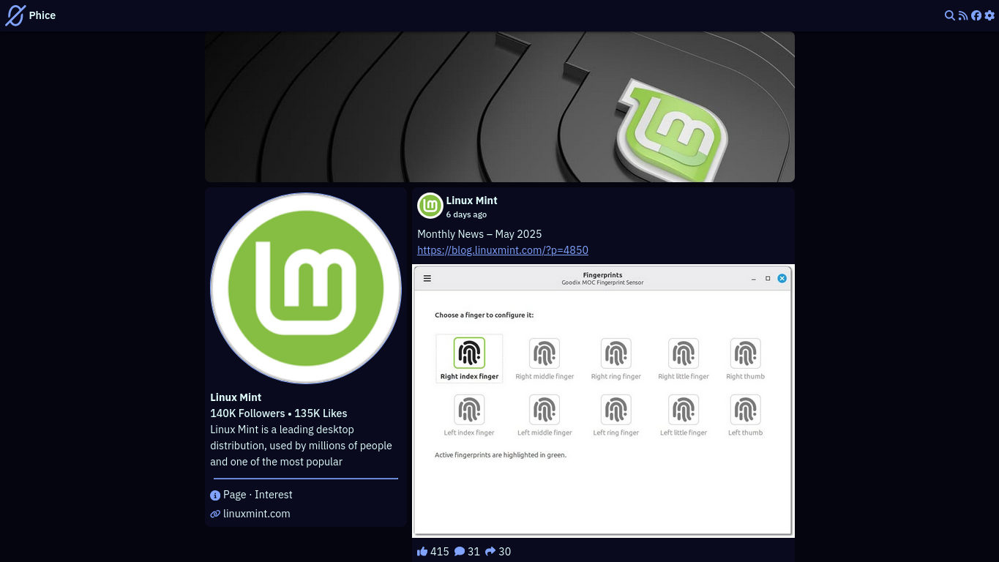

# Phice
A lightweight privacy-friendly alternative front-end for Facebook.

Inspired by [Nitter](https://github.com/zedeus/nitter), [Invidious](https://github.com/iv-org/invidious) and others

# Screenshot


# Features
* No ADS
* No trackers
* No JavaScript required
* No account required
* Lightweight
* Free and open-source
* RSS feeds

# Installation
## Dependencies:
* python >= 3.13
* uv
* a WSGI server (ex: gunicorn)

```sh
git clone "https://codeberg.org/c4ffe14e/phice.git"
cd phice
uv sync
cp config.example.json config.json
```

And start your server
```sh
uv run gunicorn -b 0.0.0.0:8000 -w 4 "app:app"
```
